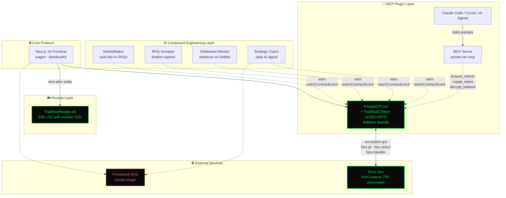

# Tradi-Nox

[](https://github.com/PugarHuda/tradi-nox/actions/workflows/test.yml)

> **Your trade. Their guess. Nobody knows.**

Tradi-Nox — a confidential OTC desk where amounts stay hidden, bids stay sealed, and trades stay quiet.

On-chain OTC desk with hidden amounts and Vickrey-fair price discovery, built on the iExec Nox confidential computing protocol.

Submission for the [iExec Vibe Coding Challenge](https://dorahacks.io/hackathon/vibe-coding-iexec) (April–May 2026).

| | |
|---|---|
| 🚀 **Live demo** | https://private-otc.vercel.app |
| 🎥 **Demo video** | https://youtu.be/_tMBT32r_kQ |
| 🐦 **Twitter post** | https://x.com/BangDropID/status/2050295042296984047 |
| 📦 **Source** | https://github.com/PugarHuda/tradi-nox |
| 📡 **Network** | Arbitrum Sepolia (chain id `421614`) |
| 🔑 **Stack** | Next.js 16 · Solidity 0.8.27 · iExec Nox · MCP |

---

## Why Tradi-Nox exists

When a whale wants to swap 1,000 ETH for USDC on-chain today, they hit two walls:

1. **Public DEX** (Uniswap, Curve, etc.) — ~8% slippage on size, MEV sandwich attacks, leaked alpha as the order sits in the mempool.
2. **OTC desk via Telegram** (GSR, Cumberland, Wintermute) — manual chat, fiat wires, no audit trail, full counterparty trust.

**$30B+ flows through OTC desks every month.** All of it via Telegram, in 2026.

Tradi-Nox is the third option: **on-chain OTC where amounts are encrypted end-to-end**.

- ✅ Settlement on-chain via ERC-7984 confidential tokens
- ✅ Direct OTC (1 maker ↔ 1 taker) **or** RFQ Mode (1 maker ↔ N takers, Vickrey pricing)
- ✅ Atomic settlement, no trusted intermediary
- ✅ Composable with any ERC-20 through the Nox Confidential Token wrapper
- ✅ Auditable via selective ACL disclosure — regulators can decrypt logs through key sharing

---

## Three-Layer Architecture



**Reading the diagram:**
- **Solid arrows** are write paths (transactions, RPC calls).
- **Dotted arrows** are read paths or AI-only side channels.
- The Core Protocol is the only layer with on-chain authority; everything else is composition.

---

## Tech Stack

| Layer | Tech |
|---|---|
| Smart Contracts | Solidity 0.8.27 · Foundry · [`@iexec-nox/nox-protocol-contracts@0.2.2`](https://www.npmjs.com/package/@iexec-nox/nox-protocol-contracts) · OpenZeppelin ERC-721 |
| Confidential primitives | iExec Nox (TEE-based) · NoxCompute proxy on Arbitrum Sepolia |
| Encryption | [`@iexec-nox/handle@0.1.0-beta.10`](https://www.npmjs.com/package/@iexec-nox/handle) — Viem v2 client |
| Frontend | Next.js 16 (App Router · Turbopack) · wagmi v2 · RainbowKit · Tailwind v4 |
| AI | Procedural SVG receipt generation (client-side) |
| NFT receipts | TradiNoxReceipt ERC-721 — fully onchain Base64-encoded SVG metadata |
| Autonomous agents | Node 22 · viem `watchContractEvent` · Vercel Cron + Functions |
| MCP server | `@modelcontextprotocol/sdk` · stdio transport |
| Hosting | Vercel (production) |

---

## Project Structure

```
tradi-nox/
├── packages/
│   ├── contracts/        # Solidity + Foundry (PrivateOTC.sol on-chain)
│   ├── web/              # Next.js frontend
│   ├── agents/           # Compound Engineering autonomous agents
│   └── mcp-server/       # MCP server exposing OTC as AI-native tools
├── .claude-plugin/       # Claude Code plugin companion (/otc-* slash commands)
├── feedback.md           # Builder feedback for the iExec Nox team
├── DEMO-SCRIPT.md        # 4-minute demo video storyboard
├── X-POST.md             # Submission post drafts
└── README.md             # This file
```

---

## Quick Start

### Prerequisites

- Node.js 22+
- pnpm 10+
- Foundry: `curl -L https://foundry.paradigm.xyz | bash`
- A wallet with Arbitrum Sepolia ETH ([Alchemy faucet](https://www.alchemy.com/faucets/arbitrum-sepolia))

### Install

```bash
git clone https://github.com/PugarHuda/tradi-nox.git
cd tradi-nox
pnpm install
cp .env.example .env
# Fill .env with your values (see .env.example for the full list)
```

### Run the frontend

```bash
pnpm dev
# Open http://localhost:3000
```

### Build, test, and deploy contracts

```bash
pnpm contracts:build         # forge build
pnpm contracts:test          # forge test (local) — fork tests skip-by-default
pnpm contracts:deploy:sepolia
```

### Run agents

```bash
pnpm agents:dev              # all 4 agents in watch mode
pnpm --filter agents market-maker   # individual agent
```

### Run the MCP server

```bash
pnpm mcp:dev                 # stdio transport, ready for Claude Code / Cursor
```

---

## End-to-End Demo (5 minutes)

1. Visit [https://private-otc.vercel.app](https://private-otc.vercel.app)
2. Connect a wallet on **Arbitrum Sepolia**
3. Go to **Faucet** → mint 10,000 cUSDC and 10 cETH (encrypted via Nox).
   Each token row shows an **Authorize Tradi-Nox** banner — click it once per
   token to approve the OTC contract as operator (60-day expiry).
4. Go to **Portfolio** → click **Decrypt** to confirm the JS SDK can read your hidden balance
5. **Create Intent** → Direct OTC: sell 1 cETH for at least 3,500 cUSDC.
   The create form blocks submit until your sell-side `setOperator` is in
   place, so dead-on-arrival intents can't ship.
6. Browse **/intents** — paginated orderbook (10 per page) with status,
   mode, pair, and "mine only" filters. URL params (`?status=open&p=2`)
   are shareable. Seed data covers Open / Filled / Cancelled / Expired
   / PendingReveal so every state path is demo-ready.
7. With another wallet, **Accept** the intent (Direct) or **Submit Bid**
   (RFQ). The accept page shows a red banner if either party hasn't
   authorized — saves gas on a doomed tx.
8. Both parties decrypt their new balances on **Portfolio**.
9. **Mint your NFT receipt** — on the settled intent page, click
   **MINT RECEIPT**. One click triggers two things: a procedural SVG
   image previews above,    and a `TradiNoxReceipt.mint(...)` ERC-721 commits
   onchain to your wallet. The button hides afterwards (one-mint-per-
   participant per intent), and you get an Arbiscan link to the NFT.

The transaction shows up on Arbiscan — but the amount is a 32-byte
handle, not a number. Settled trades produce a real ERC-721 with fully
onchain SVG metadata that survives any image host going dark.

---

## Deployed Contracts (Arbitrum Sepolia)

| Contract | Address |
|---|---|
| `PrivateOTC` (the Tradi-Nox orchestrator) | [`0x5b2C0c83e41bF9ef072d742096C49DFDB814CEB4`](https://sepolia.arbiscan.io/address/0x5b2C0c83e41bF9ef072d742096C49DFDB814CEB4) |
| `TradiNoxCToken` cUSDC | [`0x57736B816F6cb53c6B2c742D3A162E89Db162ADE`](https://sepolia.arbiscan.io/address/0x57736B816F6cb53c6B2c742D3A162E89Db162ADE) |
| `TradiNoxCToken` cETH | [`0xCdD84bA9415DFE3Dd5c0c05077B1FE194Bcf695d`](https://sepolia.arbiscan.io/address/0xCdD84bA9415DFE3Dd5c0c05077B1FE194Bcf695d) |
| `TradiNoxReceipt` (ERC-721 keepsake) | [`0xE011E57ff89a9b1450551A7cE402b75c5Bd27B85`](https://sepolia.arbiscan.io/address/0xE011E57ff89a9b1450551A7cE402b75c5Bd27B85) |

**NoxCompute proxy** (provided by iExec): [`0xd464B198f06756a1d00be223634b85E0a731c229`](https://sepolia.arbiscan.io/address/0xd464B198f06756a1d00be223634b85E0a731c229)

> The on-chain contract name remains `PrivateOTC` (immutable). "Tradi-Nox" is the user-facing brand and product name.

---

## Key Design Decision — Strategy B: Atomic Conditional Settlement

When a taker bid falls below the maker's hidden minimum, naive contracts either:
- ❌ Revert (leaks "bid too low" via the failed transaction), or
- ❌ Trust the client to validate (defeats the purpose of confidentiality)

Tradi-Nox uses **`Nox.safeSub` + `Nox.select`** to make the trade an atomic no-op when the bid is insufficient:

```solidity
(ebool sufficient, ) = Nox.safeSub(buyAmount, intent.minBuyAmount);

euint256 zero = Nox.toEuint256(0);
euint256 effectiveSell = Nox.select(sufficient, intent.sellAmount, zero);
euint256 effectiveBuy  = Nox.select(sufficient, buyAmount,        zero);

// Always settle. Whether amounts are real or zero stays encrypted.
intent.sellToken.confidentialTransferFrom(maker, taker, euint256.unwrap(effectiveSell));
intent.buyToken.confidentialTransferFrom(taker, maker, euint256.unwrap(effectiveBuy));
intent.status = IntentStatus.Filled;
```

The branch (real vs zero) lives entirely inside encrypted handles. The on-chain status is always `Filled` — observers cannot distinguish a successful trade from a no-op rejection. **Privacy preserved on rejection.**

---

## TradiNoxReceipt — Onchain ERC-721 Keepsake

Every settled trade can be commemorated with an NFT minted directly to the
participant's wallet. Both image and metadata are stored fully onchain:

- `TradiNoxReceipt.mint(intentId, mode, settleTxHash, pair)` — open mint at the
  contract level, idempotency enforced at the UI via `useExistingReceipt`
  reading past `ReceiptMinted` events.
- `tokenURI(tokenId)` returns a `data:application/json;base64,...` URI
  containing inline SVG art + structured attributes. No IPFS, no off-chain
  image host — the keepsake survives forever as long as Arbitrum does.
- Frontend collapses image generation + onchain mint into a single click;
   SVG renders instantly. On-chain mint proceeds independently.
- Receipt mint is gated to actual participants: maker (from intent struct),
  Direct taker (from `Settled` event log via `useSettledTaker`), or RFQ
  winner bidder (same event log). Random visitors see a read-only notice.

| Token | What's onchain |
|---|---|
| Tradi-Nox Receipt #N | name, description, SVG image, attributes (Mode, Pair, Intent ID, Settled At) |

---

## What's Real vs. Mock

Per hackathon brief: *"using mock data leads to disqualification"*. Honest audit:

✅ **Real (verified on-chain)**
- All three contracts deployed and responding to read calls
- `cUSDC.confidentialTotalSupply()` returns a real Nox handle (NoxCompute proxy actually responded during constructor)
- `@iexec-nox/handle` and `@iexec-nox/nox-protocol-contracts` are the real iExec packages from npm
- Vickrey logic compiles against the real Nox library
- Frontend lives at https://private-otc.vercel.app, returns HTTP 200 on every route

🛠️ **Self-deployed (real, but written by us)**
- `TradiNoxCToken.sol` — Tradi-Nox's full ERC-7984 implementation (~180 LOC) using real `Nox.transfer` / `Nox.mint` primitives. We deployed it because the [`cdefi.iex.ec`](https://cdefi.iex.ec) faucet does not publicly expose token addresses. Implements **all 8 ERC-7984 transfer functions** (4 plain + 4 transfer-and-call), `IERC7984Receiver` callback verification, and the operator pattern with `uint48` timestamp expiry. **Full spec compliance** per EIP-7984 — no partial.
- `TradiNoxReceipt.sol` — ERC-721 trade receipt with fully onchain Base64-encoded SVG `tokenURI`. ~200 LOC, no IPFS dependency.

There is **no fake data** anywhere. Every encrypted handle is a real reference to TEE-encrypted state.

---

## Documentation

- [ANALYSIS.md](ANALYSIS.md) — strategic analysis and decision rationale
- [PROJECT-SPEC.md](PROJECT-SPEC.md) — full implementation specification
- [feedback.md](feedback.md) — builder feedback for the iExec Nox team
- [DEMO-SCRIPT.md](DEMO-SCRIPT.md) — 4-minute demo video storyboard
- [X-POST.md](X-POST.md) — submission post drafts

---

## License

MIT
